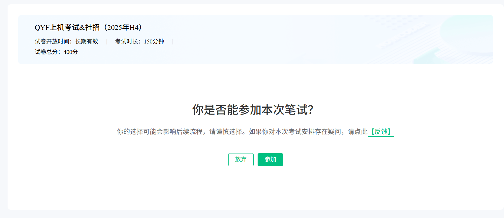
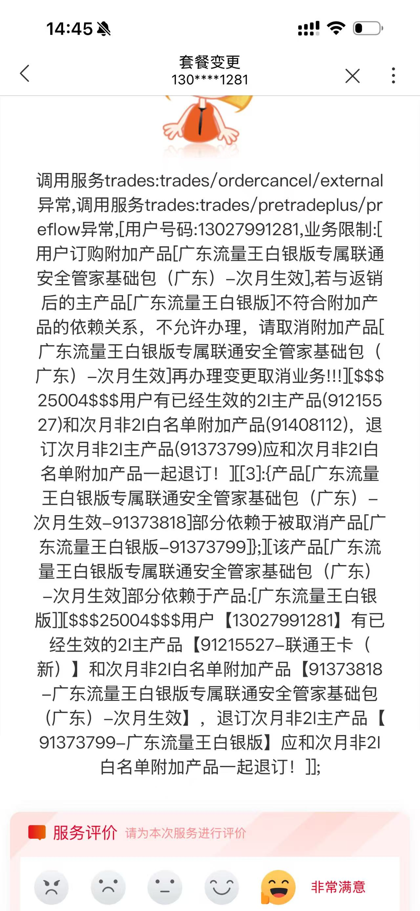
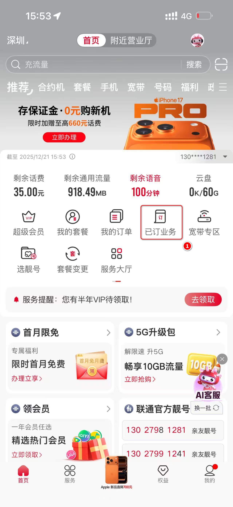
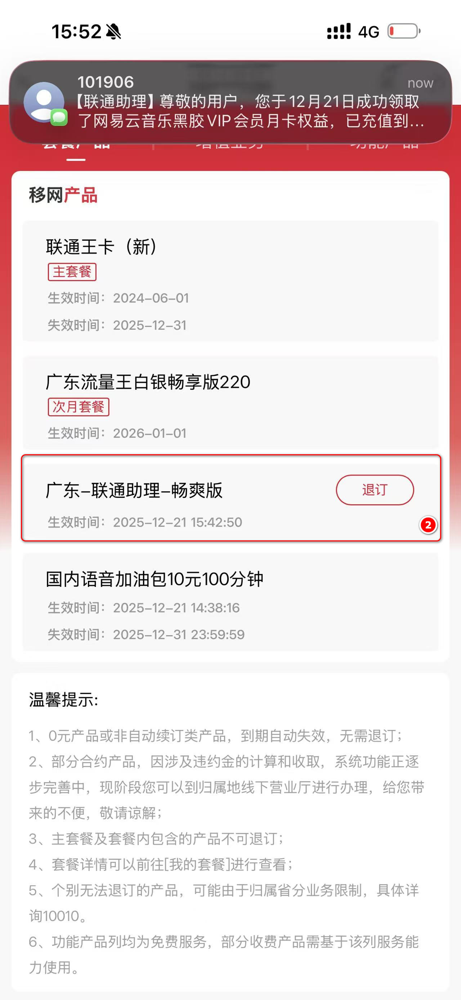

Thursday January 1 Day 001 week 1 of 2026

## 1.TodoList

## 2.可信考试练习
QYF上机考试&社招（2025年H4）
试卷开放时间：长期有效
考试时长：150分钟
试卷总分：400分
你是否能参加本次笔试？
你的选择可能会影响后续流程，请谨慎选择。如果你对本次考试安排存在疑问，请点此

亲爱的毛关松
感谢投递 启云方，现邀请你参加在线笔试，笔试结果将作为进入面试的重要筛选条件。请您提前准备好考试设备，并完成设备调试。如您因故无法参加本场考试，视为自动放弃，无其他考试机会

点击确认是否参加考试

笔试信息
试卷名称：QYF上机考试&社招（2025年H4）

考试时长：150分钟
考试链接有效期：收到笔试链接，请在5天内作答（逾期作答无效）
考试地址：https://hr.nowcoder.com/v1/s/joS3EfqR# （考试地址为你的私人专属地址，请勿转发。如无法直接打开，请拷贝完整链接并粘贴至浏览器地址栏，建议提前15分钟打开链接进行考试信息核对、调试设备等考前准备工作）

考试重要注意事项
关于帐号
你的考试地址为你的私人专属地址，请勿转发。建议提前15分钟打开笔试链接进行考试信息核对、调试设备等考前准备工作，考试开始后，请在规定时间内，按照系统提示，认真完成作答。答题过程中系统自动计时，到时自动交卷，请掌握好作答速度。
如打开后提示服务器错误，请确认打开链接正确，需拷贝完整链接（含16位ID）并粘贴至浏览器地址栏。
为提前熟悉考试环境，建议提前在题库模拟练习：进入考前模拟题库
如考试过程中卡在正在加载中，是静态文件加载，可通过以下方式解决：首先修改DNS服务为223.5.5.5和223.6.6.6或者114.114.114.114和114.114.115.115，如果仍不能成功打开或不会修改DNS，可连接手机热点完成考试。
关于考试设备
请使用谷歌最新版Chrome浏览器访问笔试网址，最新版浏览器下载地址：https://www.nowcoder.com/discuss/3793
确保您的手机设备带有摄像头、麦克风，并提前做好设备检测。
考试前请关闭其他手机浏览器窗口，关闭QQ、微信、Skype等即时通信软件，关闭Outlook等有弹窗提示消息的软件，确保网络连接畅通（下载网速建议不低于100kb/s）。
本场考试将开启录像监考。为保证监考效果，请确保网络流畅（上行网速建议不低于300 Kb/s）。
考试时允许使用草稿纸，请提前准备纸笔。考试过程中允许上厕所等短暂离开，但请控制离开时间。
如遇突发情况，如断网、电脑死机、断电等，请重新进入考试。
关于做题流程
可选择任意题型进入做题，所有题型一旦提交后将无法返回修改。
可通过试卷页面底部答案卡进行同一题型试题切换，但一旦进入某一类题型，提交后方可进入下一题型。
关于作弊
请自觉遵守考试纪律，保证个人信息与答题信息真实可靠，不可找人替代来完成考试。
考试全程会有摄像头实时监控，随机抓拍考生作答现场照片，请务必遵守考试纪律。
考试过程中可以使用计算器或手机拍照上传图片，请务必在摄像头可见范围内使用。
考试全程请不要跳出考试页面（部分试卷允许编程题离开页面使用本地IDE，以试卷考前须知为准），前3次切换会有弹窗提示，之后将不再提示但会后台记录。不要使用或访问任何与考试无关的网页、搜索、聊天工具，否则会影响你的成绩。
我们会采用技术和人工抽查等方式避免考试作弊行为。系统会自动对提交程序代码进行逐一比对，判断代码是否有大面积重复或雷同编写；对于相似度较高的程序会标识出作弊的嫌疑度，招聘官会根据此嫌疑程度，判决这些候选人是否能够进入下一轮的甄选。此外，在进入下一轮面试时，也会随机抽取相当比例的同学进行编程试题进行问答；
所有作弊行为一经查实或考试分数与后续其他测试或面试考核结果相差过大，不仅会导致申请人无法进入到下一步筛选流程中，还将永久被记录在公司人才库的诚信档案中；

关于问题反馈
如果您在考试过程中遇到牛客网使用或系统问题，请通过如下方式联系牛客网获得技术支持（仅支持系统使用问题解答，无法提供笔面试流程咨询）：此外，你可微信扫码关注服务号“牛客招聘助手”，随时查询笔试信息，还能在开考前收到考试提醒哦！
考试过程中，可以点击考试页面右侧底部的在线咨询入口，选择问题类型后发送消息
或发送邮件至邮箱 kaoshi@nowcoder.com，在邮件正文中写明个人姓名，手机号，邮箱，企业名称，试卷名称，笔试链接，问题描述
如果遇到紧急情况，也可拨打 18611869571、18611869582 求助
如果您需要咨询关于笔试或面试流程安排（例如，希望修改笔试时间、查询笔试成绩、查询面试安排等），请直接咨询企业。推荐如下常用的联系企业的渠道
查询收到的邮件通知，尝试联系邮件中企业留的联系方式
查询企业的社会招聘官网，查看企业公布的常见问题答疑或企业提供的咨询方式
查询企业的微信公众号，在后台进行留言
祝你考试顺利！:
牛客网敬上
该邮件由系统自动发送，请勿回复。如有问题请联系企业招聘HR~

进入考前模拟题库
https://www.nowcoder.com/exam/oj?questionJobId=10&subTabName=online_coding_page

## 3.联通套餐
自己在app上退套餐失败

尊敬的用户，您好！您于2025年12月21日在中国联通营业厅订购的广东-联通助理-畅爽版（编号：24GD301228）已办理成功，生效时间2025年12月21日，失效时间2029年12月31日（期满后约定内容无变化或未主动变更，有效期顺延）。产品资费：每月26元，按月自动续订。每月享热门权益(N选2），点击 https://vvm.wo116114.com:10005/cpbv/?source=4&channel=gd 或前往联通助理微信公众号【个人中心】-【权益兑换专区】进行领取兑换。如需取消本产品可点击中国联通APP链接 https://u.10010.cn/uAaJG 进行退订，或前往中国联通营业厅咨询办理。【广东联通】

使用上面的链接订阅会员